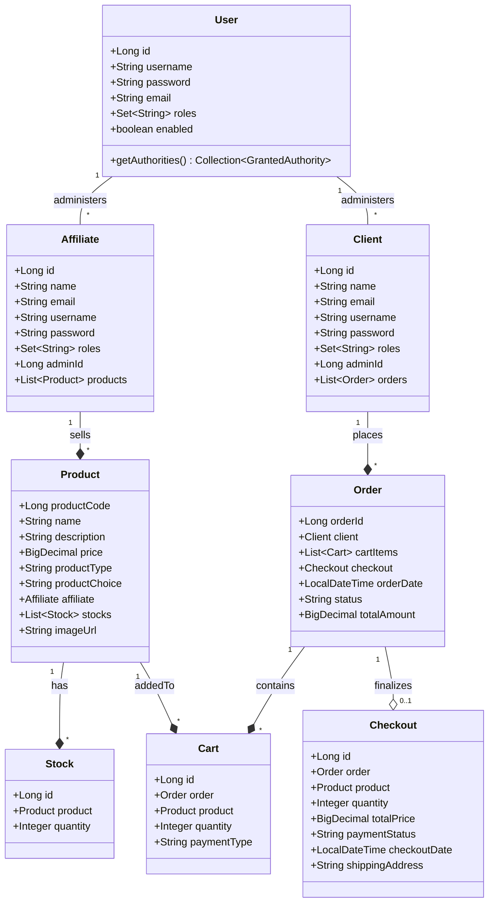

# java-avanade
API RESTful JAVA com Spring Boot para Avanade Decola Tech 2025

## Diagrama de Classes

```mermaid
classDiagram
    class User {
        +Long id
        +String username
        +String password
        +String email
        +Set~String~ roles
        +boolean enabled
        +getAuthorities() Collection~GrantedAuthority~
    }
    
    class Affiliate {
        +Long id
        +String name
        +String email
        +String username
        +String password
        +Set~String~ roles
        +Long adminId
        +List~Product~ products
    }
    
    class Client {
        +Long id
        +String name
        +String email
        +String username
        +String password
        +Set~String~ roles
        +Long adminId
        +List~Order~ orders
    }
    
    class Product {
        +Long productCode
        +String name
        +String description
        +BigDecimal price
        +String productType
        +String productChoice
        +Affiliate affiliate
        +List~Stock~ stocks
        +String imageUrl
    }
    
    class Stock {
        +Long id
        +Product product
        +Integer quantity
    }

    class Order {
        +Long orderId
        +Client client
        +List~Cart~ cartItems
        +Checkout checkout
        +LocalDateTime orderDate
        +String status
        +BigDecimal totalAmount
    }

    class Cart {
        +Long id
        +Order order
        +Product product
        +Integer quantity
        +String paymentType
    }

    class Checkout {
        +Long id
        +Order order
        +Product product
        +Integer quantity
        +BigDecimal totalPrice
        +String paymentStatus
        +LocalDateTime checkoutDate
        +String shippingAddress
    }
    
    %% Relacionamentos
    User "1" -- "*" Affiliate : administers
    User "1" -- "*" Client : administers
    Affiliate "1" --* "*" Product : sells
    Product "1" --* "*" Stock : has
    Client "1" --* "*" Order : places
    Order "1" --* "*" Cart : contains
    Order "1" --o "0..1" Checkout : finalizes
    Product "1" --* "*" Cart : addedTo
```
